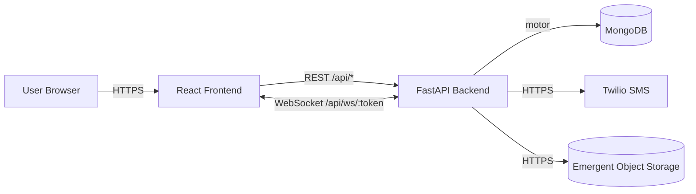
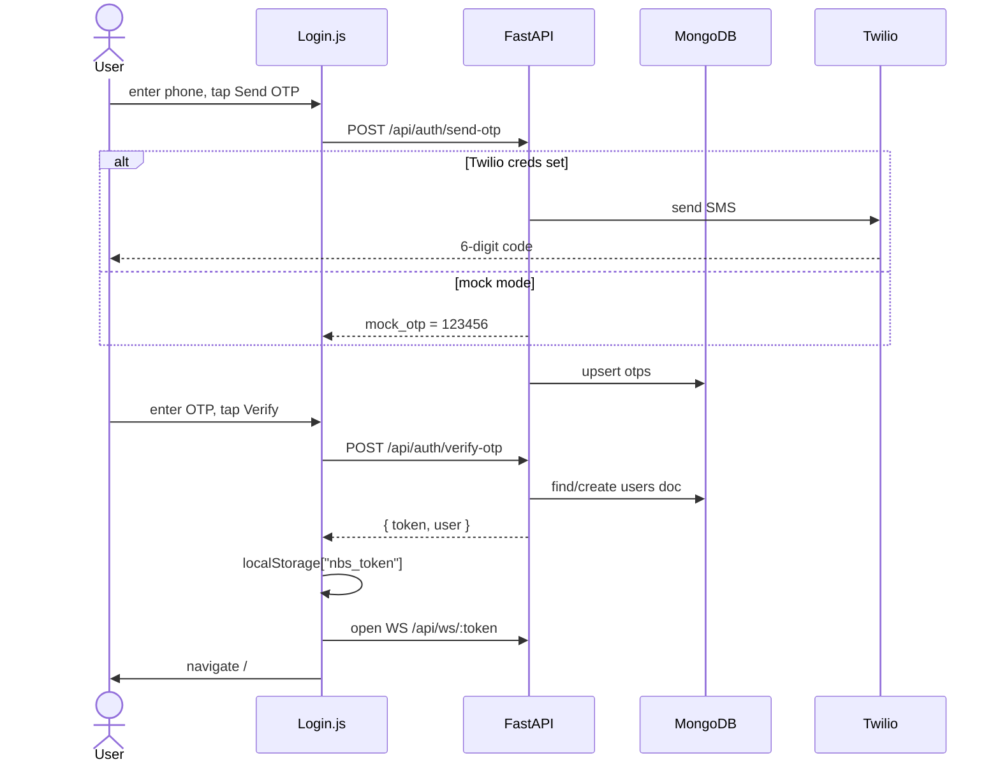
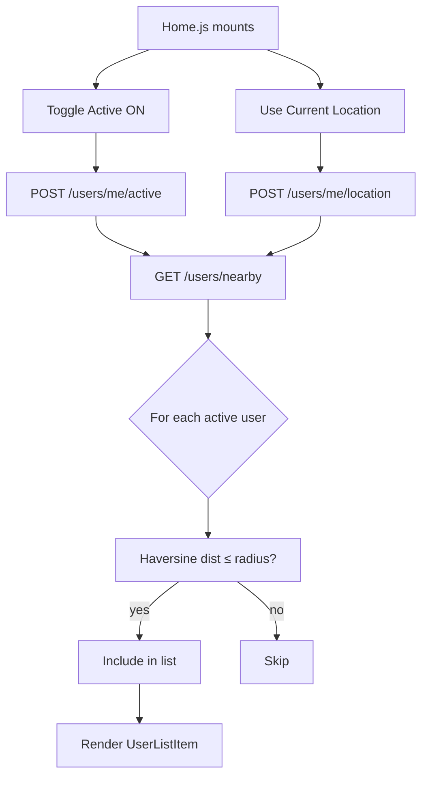
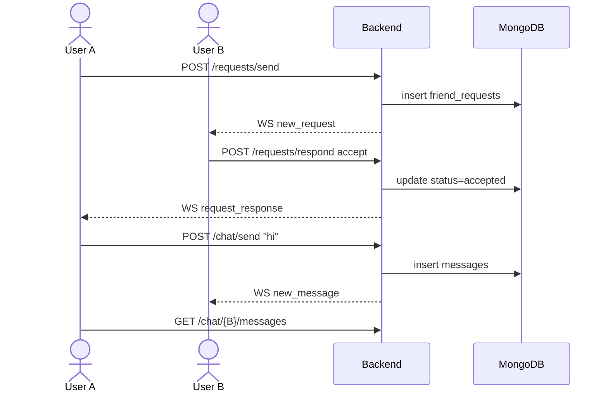
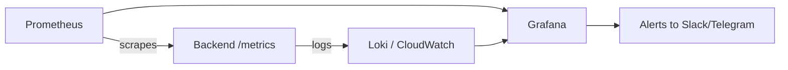

# NBS — Architecture Diagrams & Deployment Guide

> Companion to `CODE_GUIDE.md`. Open in any Markdown viewer that supports **Mermaid** (GitHub, VS Code, Obsidian).

## 1. System Architecture



## 2. Login & OTP Flow



## 3. Discover Nearby Flow



## 4. Friend Request + Real-Time Chat



## 5. MongoDB Schema (ER-ish)

```mermaid
erDiagram
    USERS ||--o{ FRIEND_REQUESTS : sends
    USERS ||--o{ MESSAGES : writes
    USERS ||--o{ BLOCKS : blocks
    USERS ||--o{ REPORTS : reports
    USERS ||--o{ FILES : uploads
    USERS {
        string id PK
        string phone
        string name
        string going_to
        string home_location
        object location
        int radius
        bool is_active
        bool is_banned
    }
    FRIEND_REQUESTS {
        string id PK
        string from_user_id FK
        string to_user_id FK
        string status
    }
    MESSAGES {
        string id PK
        string chat_key
        string from_user_id FK
        string to_user_id FK
        string text
    }
    BLOCKS { string blocker_id FK; string blocked_id FK }
    REPORTS { string reporter_id FK; string reported_id FK; string reason }
```

## 6. Frontend Route Map

```mermaid
flowchart LR
    L[/login] --> H[/]
    H --> A[/active]
    H --> M[/map]
    H --> R[/requests]
    H --> P[/profile]
    R --> C[/chat/:userId]
    P --> F[/friends]
    P --> S[/support]
    P -. admin only .-> AD[/admin]
    F --> C
```

---

# Deployment Guide

## A. Emergent Platform (default)
1. Click **Deploy** in the Emergent UI.
2. Provide your custom subdomain.
3. Platform auto-builds & exposes both backend & frontend.
4. Verify with `curl https://your-domain/api/` — should return `{"message":"NBS API"}`.

## B. Self-Host (Docker)

```dockerfile
# backend/Dockerfile
FROM python:3.11-slim
WORKDIR /app
COPY backend/requirements.txt .
RUN pip install -r requirements.txt
COPY backend /app
CMD ["uvicorn","server:app","--host","0.0.0.0","--port","8001"]
```

```yaml
# docker-compose.yml
services:
  mongo: { image: mongo:7, volumes: ["mongo:/data/db"] }
  backend:
    build: { context: ., dockerfile: backend/Dockerfile }
    environment:
      MONGO_URL: mongodb://mongo:27017
      DB_NAME: nbs
      JWT_SECRET: change-me
      EMERGENT_LLM_KEY: ${EMERGENT_LLM_KEY}
      TWILIO_ACCOUNT_SID: ${TWILIO_ACCOUNT_SID}
      TWILIO_AUTH_TOKEN: ${TWILIO_AUTH_TOKEN}
      TWILIO_FROM_NUMBER: ${TWILIO_FROM_NUMBER}
      ADMIN_PHONES: "+919599266642"
    depends_on: [mongo]
  frontend:
    build: { context: ./frontend }
    environment:
      REACT_APP_BACKEND_URL: https://your-domain.com
volumes: { mongo: {} }
```

## C. Production Checklist

| Item                          | What to do                                                          |
|-------------------------------|---------------------------------------------------------------------|
| `JWT_SECRET`                  | Change from default to a long random string                         |
| HTTPS                         | Mandatory (Geolocation API requires it)                             |
| MongoDB Atlas                 | Recommended over self-hosted Mongo                                  |
| Twilio                        | Fill `TWILIO_*` envs, verify a sender number                        |
| CORS                          | Set `CORS_ORIGINS` to your domain (not `*`)                         |
| Rate limiting                 | Add Nginx/Cloudflare in front of `/api/auth/send-otp`               |
| MongoDB index                 | `db.users.createIndex({phone:1})` and `({is_active:1, location:1})` |
| Backup                        | Daily mongodump → S3                                                |

## D. Monitoring



Add `prometheus-fastapi-instrumentator` (one-line install) for free metrics.

## E. Scaling Notes
- **WebSocket**: stateful — use sticky sessions or Redis pub/sub if running multiple backend pods.
- **Avatar uploads**: Emergent storage handles scaling. If migrating off, swap `put_object` to S3 (`boto3`).
- **Mongo geospatial**: for ≥10k active users, convert `location` to GeoJSON + create `2dsphere` index and replace Python haversine loop with `$geoNear`.

## F. Disaster Recovery
- `mongodump --uri "$MONGO_URL" --out /backups/$(date +%F)`
- Test restore monthly: `mongorestore --drop --uri "$STAGING_URL" /backups/latest`

---

See **CODE_GUIDE.md** for the line-by-line code walkthrough.
